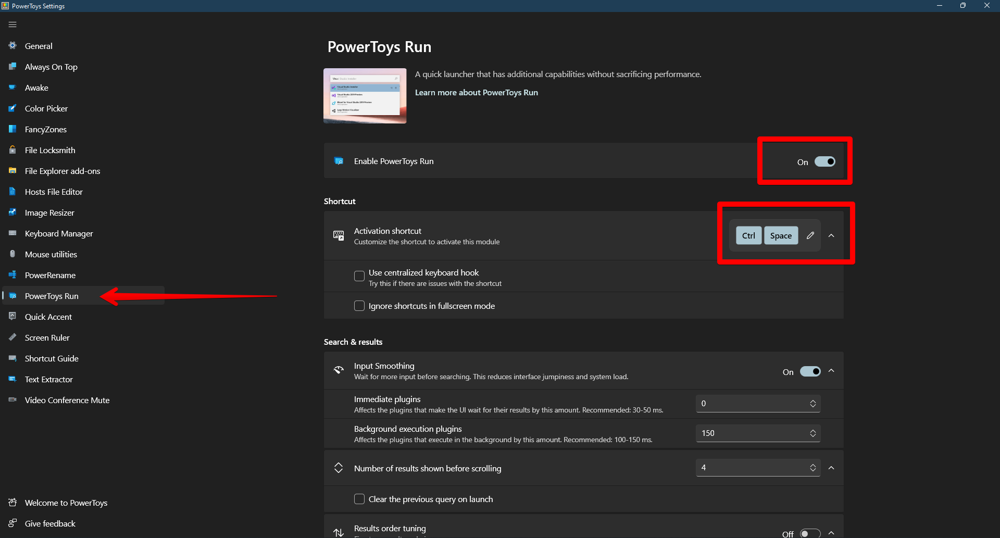

# MacOS Keyboard Behavior in Windows
This [AutoHotKey script](./mac.ahk) seeks to deliver all the **superior** MacOS keyboard behavior you love in Windows!

## Prerequisites
1. [AutoHotKey](https://www.autohotkey.com/) installed on your PC
2. Swap your Ctrl and Alt keys using [Microsoft Power Toys](https://apps.microsoft.com/store/detail/microsoft-powertoys/XP89DCGQ3K6VLD?hl=en-us&gl=us)

3. Optional (but highly recommended): Turn on PowerToys Run and assign it to Ctrl+Space (Since you swapped your Ctrl and Alt keys in the previous step)

4. Optional: Install [Monosnap](https://monosnap.com/) for screenshots.

---

## Usage
1. [Prerequisites](#prerequisites) first!
2. Create a new `mac.ahk` file in the location of your choice. I recommend `%userprofile%/Documents/AutoHotKey/mac.ahk`.
3. Open your newly created file in a text editor such as Notepad.
4. Copy the contents of this [mac.ahk](./mac.ahk) into the file you created and save changes.
5. Run the file by double-clicking it in Windows Explorer (click Yes when asked to grant admin rights to the script; this is required).

---
## Available shortcuts in this release
This script seeks to implement all shortcuts listed on the official [MacOS keyboard shortcuts page](https://support.apple.com/en-us/HT201236). The list below is current with that page as of **01/26/2023**. Items that are checked off have been implemented in the latest release.

> ### **IMPORTANT NOTE**
> The list of keyboard shortcuts below is formatted Apple-style. Use this keymap to perform these shortcuts in Windows:
> - `Command` = `Alt` key
> - `Option` = `Windows` key
> - `Control` = `Ctrl` key

### Cut, copy, paste, and other common shortcuts
- [x] Command-X: Cut the selected item and copy it to the Clipboard.
- [x] Command-C: Copy the selected item to the Clipboard.
- [x] Command-V: Paste the contents of the Clipboard into the current document or app.
- [x] Command-Z: Undo the previous command. You can then press Shift-Command-Z to Redo, reversing the undo command. In some apps, you can undo and redo multiple commands.
- [x] Command-A: Select All items.
- [x] Command-F: Find items in a document or open a Find window.
- [ ] Command-G: Find Again: Find the next occurrence of the item previously found. To find the previous occurrence, press Shift-Command-G.
- [ ] Command-H: Hide the windows of the front app. To view the front app but hide all other apps, press Option-Command-H.
- [ ] Command-M: Minimize the front window to the Dock. To minimize all windows of the front app, press Option-Command-M.
- [x] Command-O: Open the selected item, or open a dialog to select a file to open.
- [x] Command-P: Print the current document.
- [x] Command-S: Save the current document.
- [x] Command-T: Open a new tab.
- [x] Command-W: Close the front window.
- [ ] Option-Command-W: Close all windows of the front app.
- [ ] Option-Command-Esc: Force quit an app.
- [x] Command–Space bar: I recommend PowerToys Run. See [Prerequisites](#prerequisites) section.
- [ ] Control–Command–Space bar: Show the Character Viewer, from which you can choose emoji and other symbols.
- [ ] Control-Command-F: Use the app in full screen, if supported by the app.
- [ ] Space bar: Use Quick Look to preview the selected item.
- [x] Command-Tab: Switch to the next most recently used app among your open apps. 
- [ ] Command–Grave accent (`): Switch between the windows of the app you're using. (The character on the second key varies by keyboard. It's generally the key above the Tab key and to the left of the number 1.)
- [x] Shift-Command-5: I recommend [Monosnap](https://monosnap.com/) for screenshots.
- [x] Shift-Command-N: Create a new folder in the Finder.
- [ ] Command-Comma (,): Open preferences for the front app.

### Sleep, log out, and shut down shortcuts
- [ ] Option–Command–Power button* or Option–Command–Media Eject: Put your Mac to sleep.
- [ ] Control–Shift–Power button* or Control–Shift–Media Eject : Put your displays to sleep.
- [ ] Control–Power button* or Control–Media Eject : Display a dialog asking whether you want to restart, sleep, or shut down.
- [ ] Control–Command–Power button:* Force your Mac to restart, without prompting to save any open and unsaved documents.
- [ ] Control–Command–Media Eject : Quit all apps, then restart your Mac. If any open documents have unsaved changes, you will be asked whether you want to save them.
- [ ] Control–Option–Command–Power button* or Control–Option–Command–Media Eject : Quit all apps, then shut down your Mac. If any open documents have unsaved changes, you will be asked whether you want to save them.
- [ ] Control-Command-Q: Immediately lock your screen.
- [ ] Shift-Command-Q: Log out of your macOS user account. You will be asked to confirm. To log out immediately without confirming, press Option-Shift-Command-Q.

### Finder and system shortcuts
- [ ] Command-D: Duplicate the selected files.
- [ ] Command-E: Eject the selected disk or volume.
- [ ] Command-F: Start a Spotlight search in the Finder window.
- [ ] Command-I: Show the Get Info window for a selected file.
- [ ] Command-R: (1) When an alias is selected in the Finder: show the original file for the selected alias. (2) In some apps, such as Calendar or Safari, refresh or reload the page. (3) In Software Update, check for software updates again.
- [ ] Shift-Command-C: Open the Computer window.
- [ ] Shift-Command-D: Open the desktop folder.
- [ ] Shift-Command-F: Open the Recents window, showing all of the files you viewed or changed recently.
- [ ] Shift-Command-G: Open a Go to Folder window.
- [ ] Shift-Command-H: Open the Home folder of the current macOS user account.
- [ ] Shift-Command-I: Open iCloud Drive.
- [ ] Shift-Command-K: Open the Network window.
- [ ] Option-Command-L: Open the Downloads folder.
- [x] Shift-Command-N: Create a new folder.
- [ ] Shift-Command-O: Open the Documents folder.
- [ ] Shift-Command-P: Show or hide the Preview pane in Finder windows.
- [ ] Shift-Command-R: Open the AirDrop window.
- [ ] Shift-Command-T: Show or hide the tab bar in Finder windows. 
- [ ] Control-Shift-Command-T: Add selected Finder item to the Dock (OS X Mavericks or later)
- [ ] Shift-Command-U: Open the Utilities folder.
- [ ] Option-Command-D: Show or hide the Dock. 
- [ ] Control-Command-T: Add the selected item to the sidebar (OS X Mavericks or later).
- [ ] Option-Command-P: Hide or show the path bar in Finder windows.
- [ ] Option-Command-S: Hide or show the Sidebar in Finder windows.
- [ ] Command–Slash (/): Hide or show the status bar in Finder windows.
- [ ] Command-J: Show View Options.
- [ ] Command-K: Open the Connect to Server window.
- [ ] Control-Command-A: Make an alias of the selected item.
- [x] Command-N: Open a new Finder window.
- [ ] Option-Command-N: Create a new Smart Folder.
- [ ] Command-T: Show or hide the tab bar when a single tab is open in the current Finder window.
- [ ] Option-Command-T: Show or hide the toolbar when a single tab is open in the current Finder window.
- [ ] Option-Command-V: Move the files in the Clipboard from their original location to the current location.
- [ ] Command-Y: Use Quick Look to preview the selected files.
- [ ] Option-Command-Y: View a Quick Look slideshow of the selected files.
- [ ] Command-1: View the items in the Finder window as icons.
- [ ] Command-2: View the items in a Finder window as a list.
- [ ] Command-3: View the items in a Finder window in columns. 
- [ ] Command-4: View the items in a Finder window in a gallery.
- [ ] Command–Left Bracket ([): Go to the previous folder.
- [ ] Command–Right Bracket (]): Go to the next folder.
- [ ] Command–Up Arrow: Open the folder that contains the current folder.
- [ ] Command–Control–Up Arrow: Open the folder that contains the current folder in a new window.
- [ ] Command–Down Arrow: Open the selected item.
- [ ] Right Arrow: Open the selected folder. This works only when in list view.
- [ ] Left Arrow: Close the selected folder. This works only when in list view.
- [ ] Command-Delete: Move the selected item to the Trash.
- [ ] Shift-Command-Delete: Empty the Trash.
- [ ] Option-Shift-Command-Delete: Empty the Trash without confirmation dialog.
- [ ] Command–Brightness Down: Turn video mirroring on or off when your Mac is connected to more than one display.
- [ ] Option–Brightness Up: Open Displays preferences. This works with either Brightness key.
- [ ] Control–Brightness Up or Control–Brightness Down: Change the brightness of your external display, if supported by your display.
- [ ] Option–Shift–Brightness Up or Option–Shift–Brightness Down: Adjust the display brightness in smaller steps. Add the Control key to this shortcut to make the adjustment on your external display, if supported by your display.
- [ ] Option–Mission Control: Open Mission Control preferences.
- [ ] Command–Mission Control: Show the desktop. 
- [ ] Control–Down Arrow: Show all windows of the front app.
- [ ] Option–Volume Up: Open Sound preferences. This works with any of the volume keys.
- [ ] Option–Shift–Volume Up or Option–Shift–Volume Down: Adjust the sound volume in smaller steps.
- [ ] Option–Keyboard Brightness Up: Open Keyboard preferences. This works with either Keyboard Brightness key.
- [ ] Option–Shift–Keyboard Brightness Up or Option–Shift–Keyboard Brightness Down: Adjust the keyboard brightness in smaller steps.

### Document shortcuts
The behavior of these shortcuts may vary with the app you're using.

- [x] Command-B: Boldface the selected text, or turn boldfacing on or off. 
- [x] Command-I: Italicize the selected text, or turn italics on or off.
- [x] Command-K: Add a web link.
- [x] Command-U: Underline the selected text, or turn underlining on or off.
- [ ] Command-T: Show or hide the Fonts window.
- [ ] Command-D: Select the Desktop folder from within an Open dialog or Save dialog.
- [ ] Control-Command-D: Show or hide the definition of the selected word.
- [ ] Shift-Command-Colon (:): Display the Spelling and Grammar window.
- [ ] Command-Semicolon (;): Find misspelled words in the document.
- [ ] Option-Delete: Delete the word to the left of the insertion point.
- [ ] Control-H: Delete the character to the left of the insertion point. Or use Delete.
- [ ] Control-D: Delete the character to the right of the insertion point. Or use Fn-Delete.
- [ ] Fn-Delete: Forward delete on keyboards that don't have a Forward Delete   key. Or use Control-D.
- [ ] Control-K: Delete the text between the insertion point and the end of the line or paragraph.
- [ ] Fn–Up Arrow: Page Up: Scroll up one page. 
- [ ] Fn–Down Arrow: Page Down: Scroll down one page.
- [ ] Fn–Left Arrow: Home: Scroll to the beginning of a document.
- [ ] Fn–Right Arrow: End: Scroll to the end of a document.
- [x] Command–Up Arrow: Move the insertion point to the beginning of the document.
- [x] Command–Down Arrow: Move the insertion point to the end of the document.
- [x] Command–Left Arrow: Move the insertion point to the beginning of the current line.
- [x] Command–Right Arrow: Move the insertion point to the end of the current line.
- [x] Option–Left Arrow: Move the insertion point to the beginning of the previous word.
- [x] Option–Right Arrow: Move the insertion point to the end of the next word.
- [x] Shift–Command–Up Arrow: Select the text between the insertion point and the beginning of the document.
- [x] Shift–Command–Down Arrow: Select the text between the insertion point and the end of the document.
- [x] Shift–Command–Left Arrow: Select the text between the insertion point and the beginning of the current line.
- [x] Shift–Command–Right Arrow: Select the text between the insertion point and the end of the current line.
- [x] Shift–Up Arrow: Extend text selection to the nearest character at the same horizontal location on the line above.
- [x] Shift–Down Arrow: Extend text selection to the nearest character at the same horizontal location on the line below.
- [x] Shift–Left Arrow: Extend text selection one character to the left.
- [x] Shift–Right Arrow: Extend text selection one character to the right.
- [ ] Option–Shift–Up Arrow: Extend text selection to the beginning of the current paragraph, then to the beginning of the following paragraph if pressed again.
- [ ] Option–Shift–Down Arrow: Extend text selection to the end of the current paragraph, then to the end of the following paragraph if pressed again.
- [x] Option–Shift–Left Arrow: Extend text selection to the beginning of the current word, then to the beginning of the following word if pressed again.
- [x] Option–Shift–Right Arrow: Extend text selection to the end of the current word, then to the end of the following word if pressed again.
- [ ] Control-A: Move to the beginning of the line or paragraph.
- [ ] Control-E: Move to the end of a line or paragraph.
- [ ] Control-F: Move one character forward.
- [ ] Control-B: Move one character backward.
- [ ] Control-L: Center the cursor or selection in the visible area.
- [ ] Control-P: Move up one line.
- [ ] Control-N: Move down one line.
- [ ] Control-O: Insert a new line after the insertion point.
- [ ] Control-T: Swap the character behind the insertion point with the character in front of the insertion point.
- [ ] Command–Left Curly Bracket ({): Left align.
- [ ] Command–Right Curly Bracket (}): Right align.
- [ ] Shift–Command–Vertical bar (|): Center align.
- [ ] Option-Command-F: Go to the search field. 
- [ ] Option-Command-T: Show or hide a toolbar in the app.
- [ ] Option-Command-C: Copy Style: Copy the formatting settings of the selected item to the Clipboard.
- [ ] Option-Command-V: Paste Style: Apply the copied style to the selected item.
- [ ] Option-Shift-Command-V: Paste and Match Style: Apply the style of the surrounding content to the item pasted within that content.
- [ ] Option-Command-I: Show or hide the inspector window.
- [ ] Shift-Command-P:  Page setup: Display a window for selecting document settings.
- [ ] Shift-Command-S: Display the Save As dialog, or duplicate the current document.
- [ ] Shift–Command–Minus sign (-): Decrease the size of the selected item.
- [ ] Shift–Command–Plus sign (+): Increase the size of the selected item. Command–Equal sign (=) performs the same function.
- [ ] Shift–Command–Question mark (?): Open the Help menu.